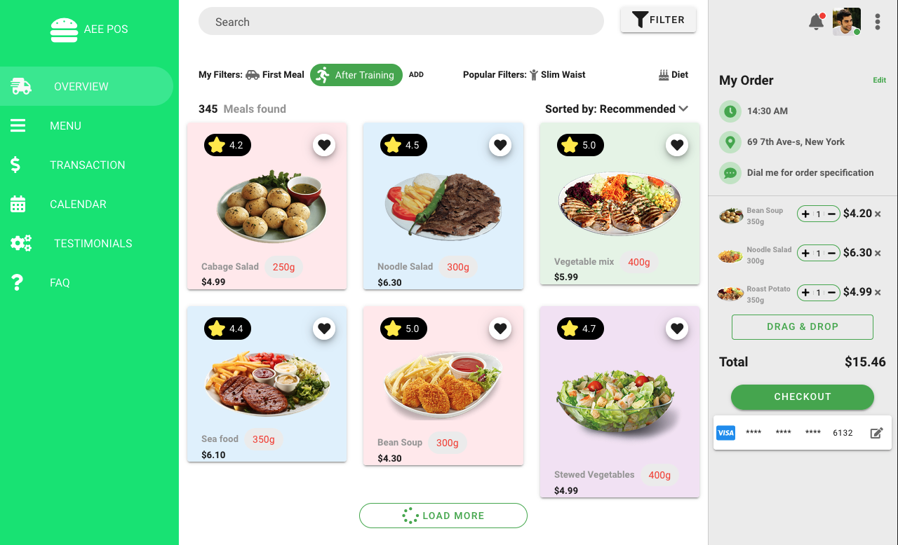

# Vuetify Food Delivery Platform
This project is based on an ["AAE IdeaPro" Vuetify tutorial](https://www.youtube.com/watch?v=gpJ-b_o8KrA).

## Project Overview

This app simulates a food delivery platform. Notice that this app has no real functionality. It is just a demonstration of Vuetify features.

Although it is just a GUI, it helps understanding often used Vuetify components. In addition, it provides a good example for practicing front-end development with Vue and Vuetify. Checkout other branches to see how we could extend this example.

### Main Screen



It consists of three main areas. On the left-hand side, a sidebar lists menu options. On the right-hand side, another sidebar shows user and order details, and payment information. Finally, the center panel shows filter options, followed by available meals. 

## Branch Features
As other "AAE IdeaPro" Vuetify tutorials, this project has many space for reuse improvements. One of the basic ideas of Vue is just reusing components. This project is entirely built on a few pages. Therefore, the code is heavily repeated. 

This branch creates components and promotes their reuse throughout the app.  

## Project setup
```
yarn install
```

```
yarn serve
```